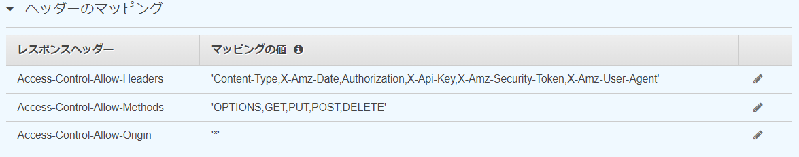
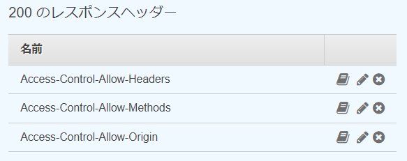

# CORS対応をしたAPI GateweyをCDKでデプロイ

このリポジトリは、CORS設定がされたAPI GatewayをCDKでデプロイするリポジトリです。  
API GatewayはLambda統合されたものです。

## CORS対応の内容
CORS対応は以下2つのリクエストパターンでやることが変わります。  
　・シンプルリクエスト  
　・シンプルでないリクエスト

### シンプルリクエストの場合のCORS対応
シンプルリクエストの場合、API Gateway+Lambda構成でやることは以下です。  
　Lambdaのレスポンスヘッダーに以下のヘッダーを追加  
　　Access-Control-Allow-Origin

このヘッダーの値に、リクエスト送信元ドメインを指定することでクロスオリジンのリクエストは成功します。  
「*」を指定すると、全ドメインからのクロスオリジンリクエストを許可します。
``` index.py
def handler(event, context):
    response_body = {"result": "Succeeded", "msg": "post process completed"}
    return {
        'statusCode': 200,
        'headers': {
            "Access-Control-Allow-Origin": "*"
        },
        'body': json.dumps(response_body)
    }
```


### シンプルリクエストでない場合のCORS対応
シンプルリクエストでない場合、API Gateway+Lambda構成でやることは以下です。  
（シンプルリクエスト時の対応に加えて、preflightリクエストの対応が必要になります。）  
　preflightリクエストでCORS有効化  
　Lambdaのレスポンスヘッダーに以下のヘッダーを追加  
　　Access-Control-Allow-Origin

#### preflightリクエストでCORS有効化  
具体的には、REST APIのOPTIONSメソッドのレスポンスヘッダーに以下のヘッダーを追加し、必要に応じて各ヘッダーに値を指定する必要があります。  
　Access-Control-Allow-Headers：CORSリクエストで使うヘッダーを指定  
　Access-Control-Allow-Methods：CORSリクエストのメソッドを指定  
　Access-Control-Allow-Origin：CORSリクエスト実行元ドメインを指定
　

API Gateway側でこれを実現するには、対象となるリクエストにOPTIONSメソッドを追加し、OPTIONSメソッドの以下部分で、上記レスポンスヘッダーを返すための設定を行います。  
　統合レスポンス  
　メソッドレスポンス  

・統合レスポンス  
統合レスポンスで、上記ヘッダーのマッピングを追加します。  
マッピングの値に、各ヘッダーで指定する値を設定します。


・メソッドレスポンス  
メソッドレスポンスの200レスポンスヘッダーに、上記ヘッダーを追加します。


## CORS設定がされたAPI GatewayをCDKで実装
API Gatewayに対する上記CORS設定をCDKで実装したのが以下です。  
lib/apigateway/creator.ts  
　addOptionsMethodにて、API GatewayリソースにOPTIONSメソッドを追加  
　　MockIntegrationが統合レスポンスの設定に該当  
　　第3引数がメソッドレスポンスの設定に該当
```
public static addOptionMethod(apiResource: Resource) : void {
        apiResource.addMethod(
            "OPTIONS",
            new MockIntegration({
                integrationResponses: [
                    {
                        statusCode: "200",
                        responseParameters: {
                            "method.response.header.Access-Control-Allow-Headers":
                                "'Content-Type,X-Amz-Date,Authorization,X-Api-Key,X-Amz-Security-Token,X-Amz-User-Agent'",
                            "method.response.header.Access-Control-Allow-Origin": "'*'",
                            "method.response.header.Access-Control-Allow-Methods":
                                "'OPTIONS,GET,PUT,POST,DELETE'",
                        },
                    },
                ],
                passthroughBehavior: PassthroughBehavior.NEVER,
                requestTemplates: {
                    "application/json": '{"statusCode": 200}',
                }
            }),
            {
                methodResponses: [
                    {
                        statusCode: "200",
                        responseParameters: {
                            "method.response.header.Access-Control-Allow-Headers": true,
                            "method.response.header.Access-Control-Allow-Origin": true,
                            "method.response.header.Access-Control-Allow-Methods": true,
                        },
                        responseModels: {
                            "application/json": Model.EMPTY_MODEL,
                        },
                    },
                ]
            },
        );

    }
```
